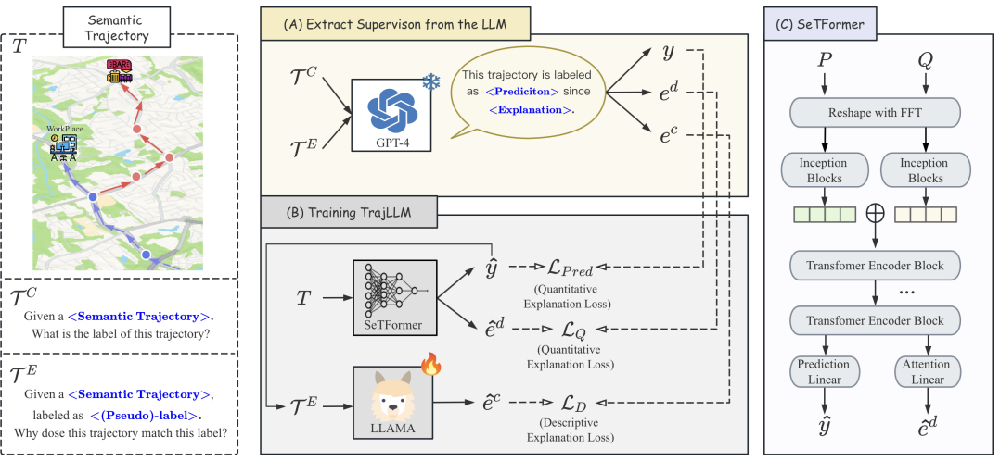

# TrajLLM

This repository contains the source code for the paper "TrajLLM: Explanation-Guided Semantic Trajectory Analysis".



## Environment setup
```
conda create --name trajllm python=3.9 -y
conda activate trajllm

conda install pytorch==2.0.1 torchvision==0.15.2 torchaudio==2.0.2 pytorch-cuda=11.8 -c pytorch -c nvidia

pip install pyg_lib torch_scatter torch_sparse torch_cluster torch_spline_conv -f https://data.pyg.org/whl/torch-2.0.1+cu118.html

pip install wandb
pip install peft
pip install pandas
pip install transformers
pip install sentencepiece
pip install datasets
pip install pcst_fast
```
## Data Preprocessing
Since extracting labels and explanations is expensive, we provide an example dataset from GeoLife that has been data preprocessed and extracted with large language model supervision.

```
# generate data_info.pkl that records features and LLMs' supervison.
python -m data_generate.py
```
## Training
Train SetFormer and explanation generator sperately.
```
# Training SeTFormer supervised by LLMs' explanations
python -m run.py
# Distill LLMs' reasoning ability to the explanation generator
python -m distill.py
```
## Generate your own dataset
You can use prompts in extrac_data to generate your own datasets.
